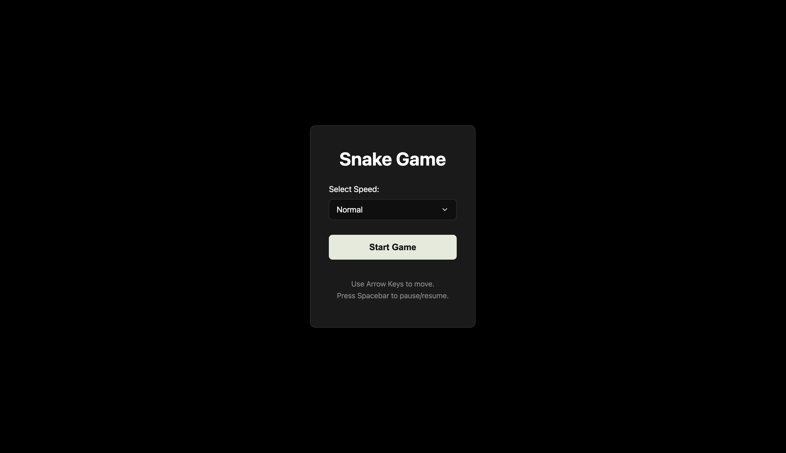
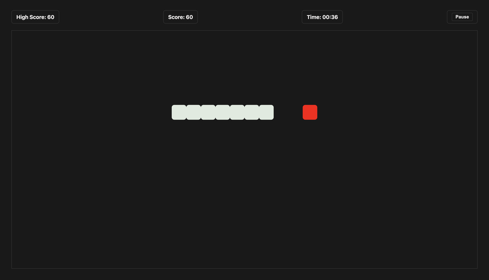
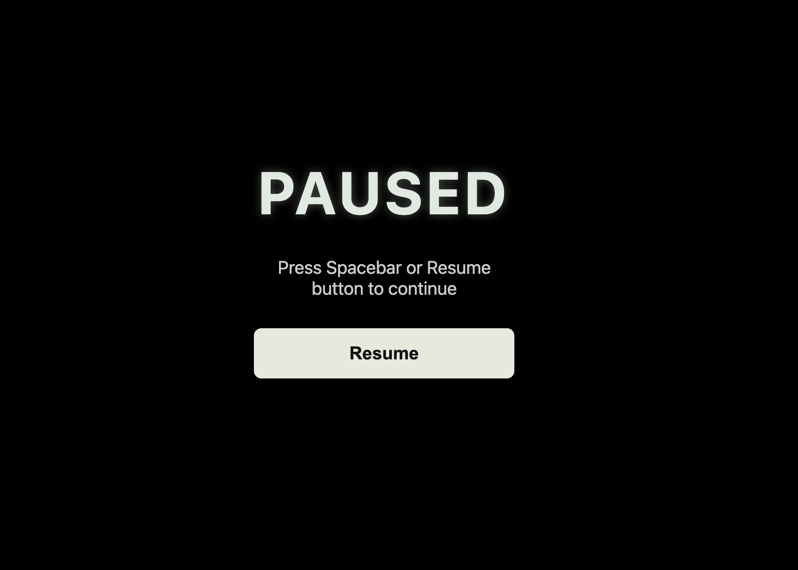
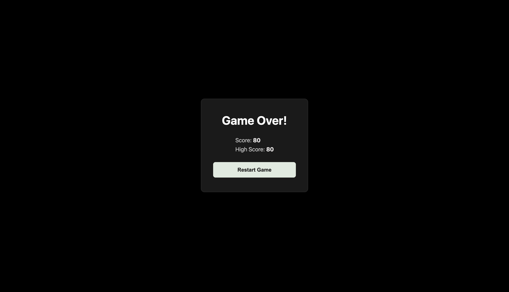

<div align="center">
  <h1>🐍 Classic Snake Game</h1>
  <p>A modern, aesthetically pleasing recreation of the classic Snake Arcade Game built with Vanilla HTML, CSS, and JavaScript.</p>
</div>
<br>




## 🎮 About The Project

This project is a fully functional, browser-based implementation of the retro Snake game. It features a sleek, glassmorphic UI design, multiple speed difficulties, score tracking, and smooth gameplay mechanics.

### ✨ Key Features

* **Modern Aesthetic:** Deep radial gradients, "frosted glass" (glassmorphism) containers, and glowing animations for a premium feel.
* **Variable Difficulty:** Choose between 4 distinct speed settings (*Slow, Normal, Fast, Insane*) right from the sleek Start Menu.
* **Responsive Controls:** Fluid movement using the standard keyboard arrow keys, with built-in logic to prevent instant self-collision (reversing direction).
* **Pause & Resume:** Easily pause the game mid-session using the on-screen button or by pressing the `Spacebar`. A stylish semi-transparent overlay indicates the paused state.
* **Score & High Score Tracking:** Points are awarded for every food item eaten, and your highest score of the session is tracked automatically.
* **Instant Restart:** A custom Game Over modal appears when you crash, allowing you to instantly reset the board and try again without refreshing the page.

<br>

## 📸 Screenshots

| Gameplay | Paused State | Game Over |
|:---:|:---:|:---:|
|  |  |  |

<br>

## 🛠️ Built With

This project relies purely on front-end web fundamentals. No external logic libraries or frameworks were used.

* **HTML5:** Semantic structure and layout elements.
* **CSS3:** Advanced styling including CSS Variables (Custom Properties), Flexbox/Grid layouts, glassmorphism (`backdrop-filter`), animations, and Google Fonts (`Outfit`).
* **Vanilla JavaScript (ES6+):** Game loop (`setInterval`), DOM manipulation, Event Listeners for keyboard input, and state management (score, timers, arrays for snake segments).

<br>

## 🚀 How To Play

### Installation / Setup

Since this is a vanilla web project, no build tools or package managers (`npm`) are required!

1. Clone the repository to your local machine:
   ```bash
   git clone https://github.com/abhijeeth-dev-25/Games.git
   ```
2. Navigate to the `snake-game` directory.
3. Simply open the `index.html` file in any modern web browser (Chrome, Firefox, Safari, Edge).
   * *Optional:* If you use VS Code, you can use the [Live Server](https://marketplace.visualstudio.com/items?itemName=ritwickdey.LiveServer) extension to serve the file locally.

### Game Controls

* **Arrow Keys (`↑` `↓` `←` `→`):** Control the direction of the snake.
* **Spacebar (`␣`):** Pause or Resume the game.
* **Mouse Context:** Use your mouse to select the starting game speed and to click the "Pause", "Resume", and "Restart Game" UI buttons.

<br>

## 🎯 Gameplay Rules

1. **Eat the Food:** Guide the snake to eat the glowing red food blocks that appear randomly on the board.
2. **Grow and Score:** Each time the snake eats food, it grows longer by one block, and your score increases by 10 points.
3. **Don't Hit the Walls:** If the snake's head hits any of the four borders of the game board, it's Game Over.
4. **Don't Bite Yourself:** If the snake's head collides with any part of its own body, it's Game Over.

---
*Created as a fun personal project to practice DOM manipulation and CSS design.*
